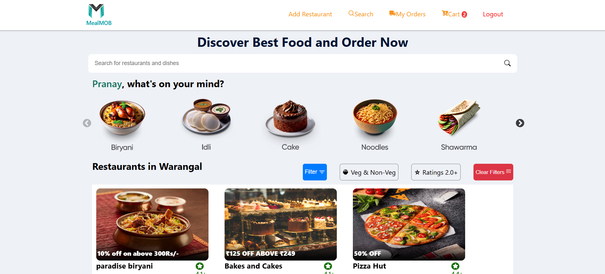
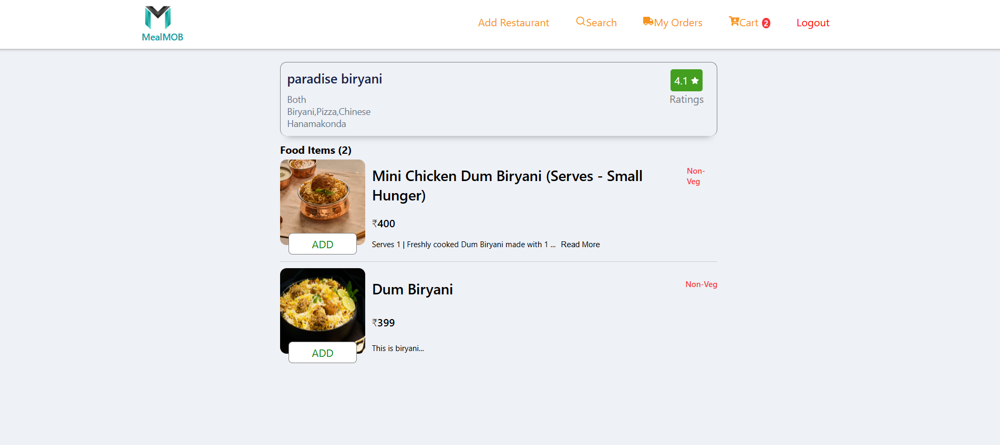
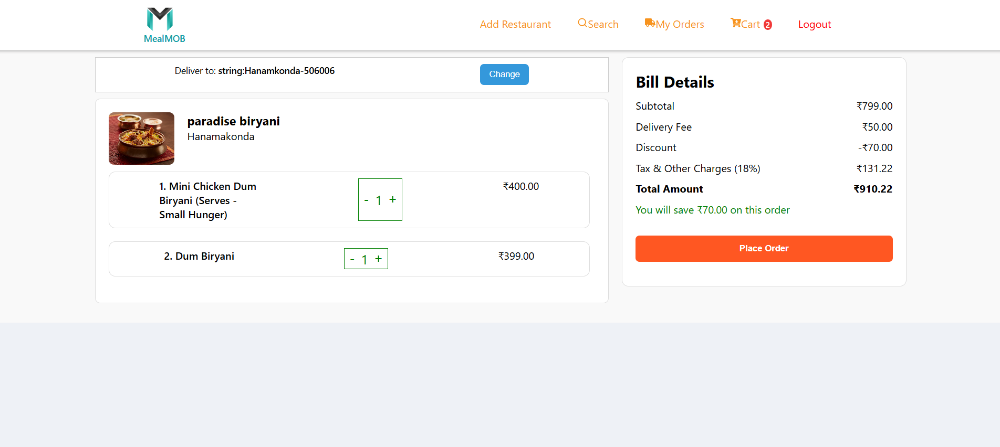
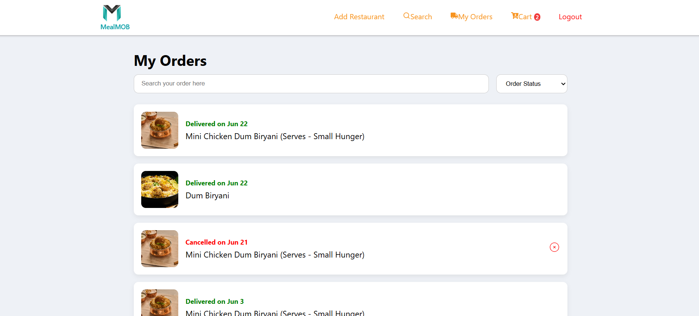
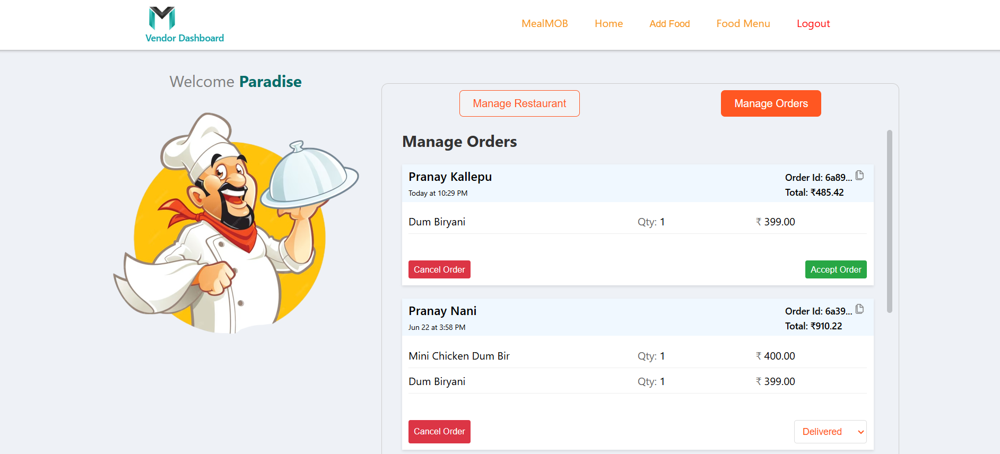
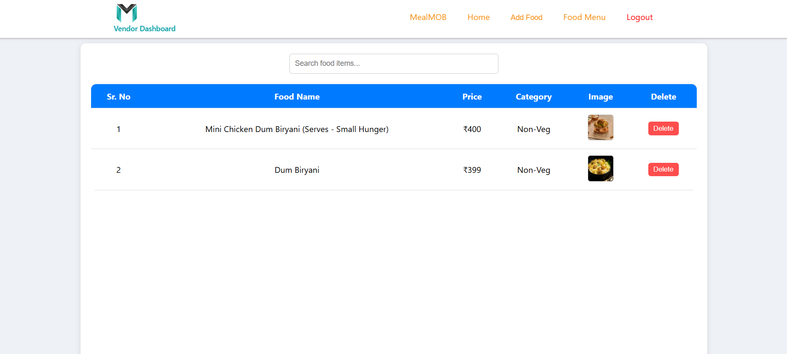

# MealMOB

### [Live Demo](https://mealmob-client.onrender.com/)

MealMOB is a full-stack food delivery platform inspired by applications like Swiggy and Zomato.

The platform allows customers to discover restaurants, search and filter food options, browse restaurant menus, manage their cart, place orders, and track order status.

MealMOB also provides a vendor workflow where vendors can manage restaurants, food items, and customer orders.

---

## Table of Contents

- [Live Demo](#live-demo)
- [Screenshots](#screenshots)
- [Architecture Diagram](#architecture-diagram)
- [Application Flow](#application-flow)
- [Features](#features)
- [Tech Stack](#tech-stack)
- [Authentication Flow](#authentication-flow)
- [API Documentation](#api-documentation)
- [Database Schema](#database-schema)
- [Project Structure](#project-structure)
- [Local Setup](#local-setup)
- [Environment Variables](#environment-variables)
- [Testing](#testing)
- [Challenges & Solutions](#challenges--solutions)
- [Engineering Decisions](#engineering-decisions)
- [Future Improvements](#future-improvements)
- [Author](#author)
- [License](#license)

---

## Live Demo

**Frontend:**  
https://mealmob-client.onrender.com/

**GitHub Repository:**  
https://github.com/PranayKallepu/mealMOB

---

## Screenshots

### Customer Application

#### Home / Restaurant Discovery



#### Restaurant Details



<!-- #### Food Menu

 -->

#### Cart



#### My Orders



<!-- Add screenshots here -->

### Vendor Dashboard



#### Menu Management



<!-- Add screenshots here -->

---

## Architecture

```text
                         MealMOB
                            |
              +-------------+-------------+
              |                           |
        React Frontend              Node.js Backend
              |                           |
        React Router                  Express.js
              |                           |
       Context API                  REST APIs
              |                           |
           Axios                  Middleware / JWT
              |                           |
              +-------------+-------------+
                            |
                         MongoDB
                            |
                         Mongoose
                            |
                    +-------+-------+
                    |               |
                 Customer         Vendor
                     |                |
               Image Upload       Restaurant
                     |                |
                  Multer          Food Items
                     |
                Cloudinary

```

## Application Flow

```text
                  CUSTOMER                                         VENDER

                Login / Signup                                    Vendor Login
                      ↓                                              ↓
            Restaurant Discovery                               Vendor Dashboard
                      ↓                                              ↓
             Search / Filtering                                Manage Restaurant
                      ↓                                              ↓
            Restaurant Details                                 Manage Food Items
                      ↓                                              ↓
                Browse Menu                                    View Customer Orders
                      ↓                                              ↓
             Add Items to Cart                                 Update Order Status
                      ↓
                  Checkout
                      ↓
                Place Order
                      ↓
             View Order Status


```

## Features

- **User Authentication**: Secure login/signup using JWT tokens.
- **Vendor Authentication**: Only approved vendors can add restaurants.
- **Restaurant Listings & Filters**: Search and filter restaurants by name, rating, or food items.
- **Restaurant Navigation**: View individual restaurant details and menu.
- **Cart System**: Users can add food items to the cart before ordering.
- **Responsive UI**: Designed with a mobile-first approach for better accessibility.

## Tech Stack

### Frontend:

- React.js
- JavaScript
- Styled Components
- React Router
- Axios
- Context API
- Framer Motion
- React Hot Toast

### Backend:

- Node.js
- Express.js
- REST APIs
- JWT
- bcryptjs
- Mongoose
- Multer
- Cloudinary
- CORS

### Database:

- MongoDB (MongoDB Atlas)

### Development Tools

- Git
- GitHub
- Postman
- HTTP API testing

## Authentication Flow

MealMOB uses JWT-based authentication to protect private API resources.

```text
                     Login / Signup
                           |
                           v
                  Backend Validation
                           |
                           v
                     JWT Generated
                           |
                           v
                 Token Sent by Client
                           |
                           v
              Authentication Middleware
                           |
                 +---------+---------+
                 |                   |
                 v                   v
             User Auth          Vendor Auth
                 |                   |
                 v                   v
          Protected User      Protected Vendor
             Routes                Routes
```

### Authentication Process

- User or vendor submits login credentials.
- Backend validates the credentials.
- Passwords are securely compared using bcrypt.
- Backend generates a JWT.
- Client sends the JWT with protected requests.
- Authentication middleware verifies the token.
- The authenticated user/vendor is attached to the request.
- The controller processes the authorized request.

### Protected Routes

Customer-protected functionality includes:

- Cart
- Orders
- Order details
- User-specific operations

### Vendor-protected functionality includes:

- Restaurant management
- Food/menu management
- Vendor dashboard
- Order management

## API Documentation

The backend follows a modular REST API architecture.

```text
            HTTP Request
               |
               v
               Route
               |
               v
            Middleware
               |
               v
            Controller
               |
               v
            Mongoose Model
               |
               v
            MongoDB
               |
               v
            JSON Response
```

### API Modules

The backend is organized into separate modules for:

Users
Vendors
Restaurants
Food Items
Orders
Authentication APIs
POST /signup
POST /login
Vendor APIs

### Vendor routes handle:

Vendor signup
Vendor login
Vendor authentication
Vendor restaurant operations
Vendor food/menu operations
Restaurant APIs

### Restaurant APIs handle:

Restaurant listing
Restaurant details
Restaurant creation
Restaurant updates
Restaurant deletion
Restaurant filtering
Food APIs

### Food APIs handle:

Food item listing
Food item details
Food item creation
Food item updates
Food item deletion
Food filtering

### Order APIs

```text
POST   /orders

GET    /all-orders

GET    /order-details/:orderId

PUT    /order-status/:orderId

DELETE /delete-order/:orderId
```

### Order Flow

```text
      Restaurant
         |
         v
      Food Items
         |
         v
      Cart
         |
         v
      Checkout
         |
         v
      POST /orders
         |
         v
      MongoDB
         |
         v
      Vendor Dashboard
         |
         v
      Update Order Status
         |
         v
      Customer
```

Check the individual route files in server/routes/ for the exact API prefix and authorization middleware used by each endpoint.

## Database Schema

MealMOB uses MongoDB with Mongoose for data persistence.

### Main Entities

```text
User
 |
 +----------------+
                  |
                  v
                Order
                  |
                  +---- Restaurant
                  |
                  +---- Food Items
                  |
                  +---- Delivery Address


Vendor
 |
 +---- Restaurant
          |
          +---- Food Items
```

## Main Collections

User

Stores customer authentication and profile information.

Vendor

Stores vendor authentication and vendor information.

Restaurant

Stores restaurant information and restaurant-related data.

Food Item

Stores food/menu information belonging to restaurants.

Order

Stores customer orders, ordered items, restaurant reference, delivery address, total amount, and order status.

## Order Structure

An order contains information such as:

```text
Order
 |
 +-- userId
 |
 +-- restaurantId
 |
 +-- items
 |     |
 |     +-- foodId
 |     +-- foodName
 |     +-- price
 |     +-- quantity
 |     +-- foodImage
 |
 +-- address
 |     |
 |     +-- receiverName
 |     +-- mobile
 |     +-- houseNumber
 |     +-- city
 |     +-- state
 |     +-- pincode
 |
 +-- total
 |
 +-- status
 |
 +-- createdAt
 |
 +-- updatedAt
```

### Order Status

```text
Pending
   |
   v
In Progress
   |
   v
Delivered
```

### Orders can also reach:

Cancelled

## Project Structure

```text
mealMOB/
│
├── client-side/
│   │
│   ├── public/
│   │
│   ├── src/
│   │   │
│   │   ├── components/
│   │   │
│   │   ├── context/
│   │   │
│   │   ├── pages/
│   │   │   │
│   │   │   ├── Home/
│   │   │   ├── Search/
│   │   │   ├── FoodItems/
│   │   │   ├── Cuisines/
│   │   │   ├── Cart/
│   │   │   ├── MyOrders/
│   │   │   ├── OrderDetails/
│   │   │   ├── Dashboard/
│   │   │   ├── VendorHome/
│   │   │   ├── VendorMenu/
│   │   │   └── VendorDashboard/
│   │   │
│   │   ├── utils/
│   │   │
│   │   ├── App.js
│   │   └── index.js
│   │
│   └── package.json
│
├── server/
│   │
│   ├── config/
│   │
│   ├── controllers/
│   │
│   ├── middleware/
│   │
│   ├── models/
│   │
│   ├── routes/
│   │
│   ├── uploads/
│   │
│   ├── server.js
│   ├── test.http
│   └── package.json
│
└── README.md
```

### Backend Structure

The backend follows separation of concerns:

```text
Routes
   |
   v
Middleware
   |
   v
Controllers
   |
   v
Models
   |
   v
MongoDB
```

## Local Setup

Prerequisites

Make sure you have installed:

Node.js
npm
MongoDB Atlas account
Cloudinary account

1. Clone the Repository
   git clone https://github.com/PranayKallepu/mealMOB.git
   cd mealMOB
2. Install Backend Dependencies
   cd server
   npm install
3. Configure Environment Variables

Create:

server/.env

Add the required environment variables.

See the Environment Variables section.

4. Start the Backend
   node server.js

The Express server will start using the configured backend port.

5. Install Frontend Dependencies

Open a new terminal:

cd client-side
npm install 6. Start the Frontend
npm start

The React application will start in development mode.

## Environment Variables

Create a .env file inside the server directory.

```code
PORT=

MONGODB_URI=

JWT_SECRET=

CLOUDINARY_CLOUD_NAME=
CLOUDINARY_API_KEY=
CLOUDINARY_API_SECRET=
```

### Environment Variable Description

Variable Description
PORT Port used by the Express server
MONGODB_URI MongoDB Atlas connection string
JWT_SECRET Secret used to sign and verify JWT tokens
CLOUDINARY_CLOUD_NAME Cloudinary cloud name
CLOUDINARY_API_KEY Cloudinary API key
CLOUDINARY_API_SECRET Cloudinary API secret

Important: Never commit real credentials, API keys, database URLs, or JWT secrets to GitHub.

For public repositories, create a .env.example file containing placeholder values.

## Testing

### API Testing

Backend APIs were tested during development before frontend integration.

The repository also contains:

server/test.http

which can be used for HTTP endpoint testing.

### Important Test Cases

#### Authentication

User signup
User login
Invalid credentials
Vendor signup
Vendor login
Invalid JWT
Missing JWT
Protected route access

#### Restaurants

Get restaurants
Search restaurants
Filter restaurants
Get restaurant details

#### Food Items

Get food items
Get food details
Create food item
Update food item
Delete food item

#### Orders

Create order
Get order details
Update order status
Delete/cancel order
Invalid order data
Unauthorized order access

## Future Automated Testing

### Planned testing improvements:

Jest
Supertest
React Testing Library
API integration tests
Authentication tests
Authorization tests
Cart tests
Order lifecycle tests

## Challenges & Solutions

### 1. MongoDB Network Access

Problem

The backend initially faced connectivity issues while connecting to MongoDB Atlas.

Solution

Configured MongoDB Atlas network access and allowed the development environment to establish the database connection.

### 2. Image Uploads

Problem

Restaurant and food images needed to be uploaded and stored without keeping image files directly inside MongoDB.

Solution

Used Multer to process multipart file uploads and Cloudinary for cloud-based image storage.

```text
Frontend
|
v
Image Upload
|
v
Multer
|
v
Cloudinary
|
v
Image URL
|
v
MongoDB
```

### 3. CORS

Problem

The frontend and backend were running on different origins during development and deployment.

Solution

Configured Express CORS middleware to allow communication between the React frontend and backend API.

### 4. Authentication

Problem

Protected resources needed to identify the authenticated user or vendor.

Solution

Implemented JWT authentication middleware that verifies the token and identifies the authenticated entity before protected controllers execute.

### 5. Shared Frontend State

Problem

Cart and order-related state needed to be accessed by multiple components and pages.

Solution

Used React Context API to share application state without passing data through multiple levels of component props.

## Engineering Decisions

#### React

React was chosen for building a component-based frontend with reusable UI components.

#### React Context API

Context API was used for shared cart and order state because the application's current state-management requirements are relatively focused.

#### Express.js

Express provides a lightweight structure for building REST APIs and organizing routes, middleware, and controllers.

#### MongoDB

MongoDB was selected because the application contains document-oriented data such as restaurants, food items, users, vendors, and orders.

#### Mongoose

Mongoose provides schema definitions, validation, and convenient interaction with MongoDB.

#### JWT

JWT was used to implement stateless authentication for protected API requests.

#### Cloudinary

Cloudinary was used to store and serve restaurant and food images rather than storing image binaries directly in MongoDB.

#### Multer

Multer handles multipart/form-data requests and processes uploaded image files before sending them to Cloudinary.

## Future Improvements

### Security & Authorization

Implement stricter role-based authorization
Restrict customers to their own orders
Restrict vendors to their own restaurants and orders
Add resource-level authorization
Add request schema validation
Add API rate limiting
Add centralized error handling
Improve security headers

### Order Management

Calculate order totals on the backend
Add payment integration
Add payment status
Add payment methods
Add richer order statuses

```text
Pending
↓
Confirmed
↓
Preparing
↓
Ready
↓
Out for Delivery
↓
Delivered
```

Store order status history
Add cancellation rules
Add reorder functionality

### Performance

Add pagination
Add MongoDB indexes
Add Redis caching
Optimize restaurant search
Optimize food search
Reduce unnecessary API requests
Implement lazy loading where appropriate

### Customer Features

Ratings and reviews
Favorites / wishlist
Saved addresses
Coupons
Promotional offers
Order history improvements
Reorder previous meals
Restaurant open/closed status
Estimated delivery time

### Vendor Features

Vendor analytics dashboard
Revenue statistics
Daily/weekly/monthly sales
Top-selling food items
Order statistics
Restaurant availability management
Inventory/availability management

### Admin Features

Introduce an admin role with role-based access control.

```text
                  MealMOB
                     |
          +----------+----------+
          |          |          |
       Customer    Vendor      Admin
          |          |          |
       Orders     Restaurant   Users
       Cart       Food Items   Vendors
       Reviews    Orders       Restaurants
                              Orders
                              Analytics
```

Admin capabilities could include:

User management
Vendor approval
Restaurant management
Order monitoring
Platform analytics
Coupon management
Category management

### Real-Time Features

Implement WebSockets for real-time order updates.

```text
Customer
    |
    | Order placed
    v
Backend
    |
    | WebSocket event
    v
Vendor
    |
    | Status updated
    v
Backend
    |
    | WebSocket event
    v
Customer
```

This could provide live updates such as:

Order confirmed
Food being prepared
Food ready
Out for delivery
Delivered

## Engineering Improvements

Add automated API testing
Add frontend component testing
Add Swagger/OpenAPI documentation
Add Docker configuration
Add GitHub Actions CI/CD
Add structured logging
Add application monitoring
Add production error tracking
Improve API validation
Improve database indexing

## Author

#### Pranay Kallepu

- GitHub: https://github.com/PranayKallepu
- Email: pranaykallepu05@gmail.com

## License

This project is a personal portfolio project created for learning, demonstration, and interview purposes.

#### 🚀 MealMOB – Simplifying Food Delivery!
