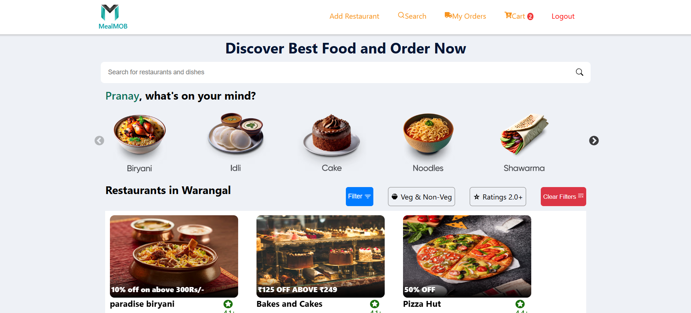
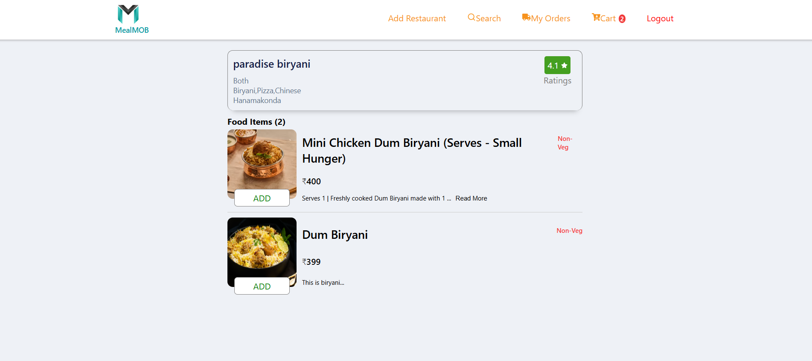
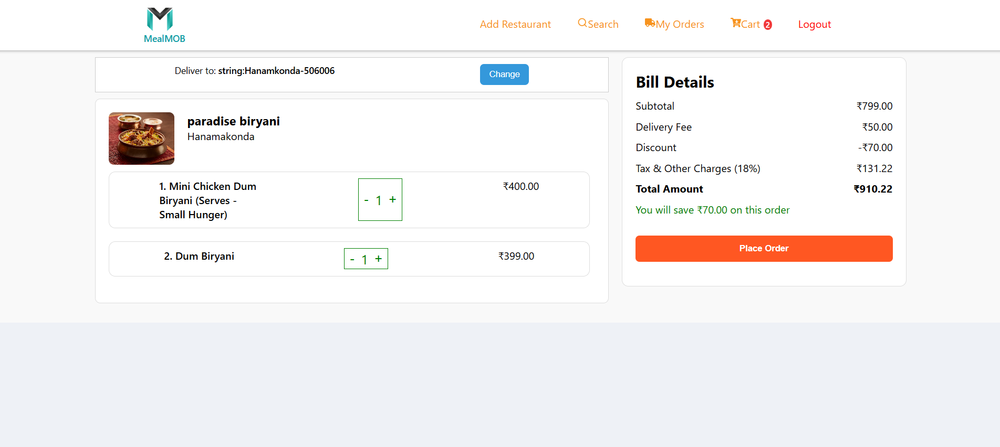
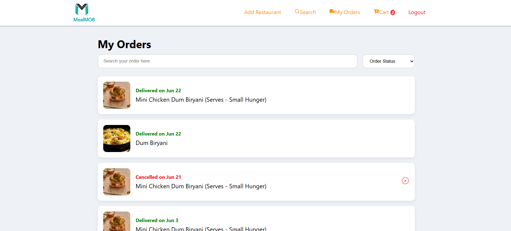
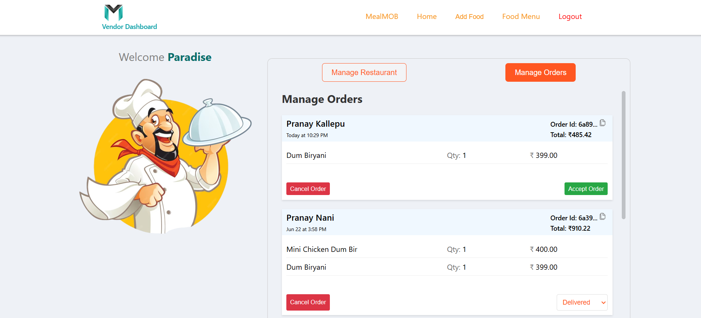
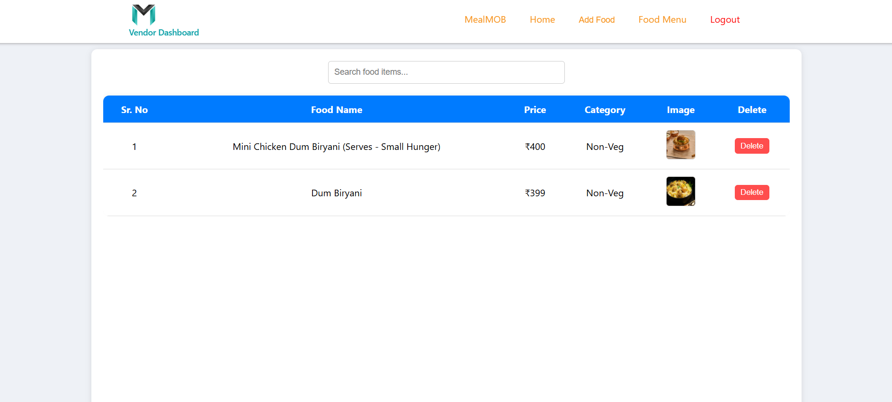

# MealMOB

### [Live Demo](https://mealmob-client.onrender.com/)

MealMOB is a full-stack food delivery platform inspired by applications like Swiggy and Zomato.

The platform allows customers to discover restaurants, search and filter food options, browse restaurant menus, manage their cart, place orders, and track order status.

MealMOB also provides a vendor workflow where vendors can manage restaurants, food items, and customer orders.

---

## Table of Contents

- [Live Demo](#live-demo)
- [Screenshots](#screenshots)
- [Application Flow](#application-flow)
- [Features](#features)
- [Tech Stack](#tech-stack)
- [API Documentation](#api-documentation)
- [Project Structure](#project-structure)
- [Local Setup](#local-setup)
- [Environment Variables](#environment-variables)
- [Author](#author)
- [License](#license)

---

## Live Demo

**Frontend:**  
https://mealmob-client.onrender.com/

**GitHub Repository:**  
https://github.com/PranayKallepu/mealMOB

---

## Screenshots

### Customer Application

#### Home / Restaurant Discovery



#### Restaurant Details



<!-- #### Food Menu

 -->

#### Cart



#### My Orders



<!-- Add screenshots here -->

### Vendor Dashboard



#### Menu Management



<!-- Add screenshots here -->

---

## Architecture

```text
                         MealMOB
                            |
              +-------------+-------------+
              |                           |
        React Frontend              Node.js Backend
              |                           |
        React Router                  Express.js
              |                           |
       Context API                  REST APIs
              |                           |
           Axios                  Middleware / JWT
              |                           |
              +-------------+-------------+
                            |
                         MongoDB
                            |
                         Mongoose
                            |
                    +-------+-------+
                    |               |
                 Customer         Vendor
                     |                |
               Image Upload       Restaurant
                     |                |
                  Multer          Food Items
                     |
                Cloudinary

```

## Application Flow

```text
                  CUSTOMER                                         VENDER

                Login / Signup                                    Vendor Login
                      ↓                                              ↓
            Restaurant Discovery                               Vendor Dashboard
                      ↓                                              ↓
             Search / Filtering                                Manage Restaurant
                      ↓                                              ↓
            Restaurant Details                                 Manage Food Items
                      ↓                                              ↓
                Browse Menu                                    View Customer Orders
                      ↓                                              ↓
             Add Items to Cart                                 Update Order Status
                      ↓
                  Checkout
                      ↓
                Place Order
                      ↓
             View Order Status


```

## Features

- **User Authentication**: Secure login/signup using JWT tokens.
- **Vendor Authentication**: Only approved vendors can add restaurants.
- **Restaurant Listings & Filters**: Search and filter restaurants by name, rating, or food items.
- **Restaurant Navigation**: View individual restaurant details and menu.
- **Cart System**: Users can add food items to the cart before ordering.
- **Responsive UI**: Designed with a mobile-first approach for better accessibility.

## Tech Stack

### Frontend:

- React.js
- JavaScript
- Styled Components
- React Router
- Axios
- Context API
- Framer Motion
- React Hot Toast

### Backend:

- Node.js
- Express.js
- REST APIs
- JWT
- bcryptjs
- Mongoose
- Multer
- Cloudinary
- CORS

### Database:

- MongoDB (MongoDB Atlas)

### Development Tools

- Git
- GitHub
- Postman
- HTTP API testing

## API Documentation

### User routes

```text
POST   /signup

POST   /LOGIN
```

### Vendor routes

```text
POST   /register

POST   /login
```

### Restaurant APIs

```text
POST   /add-restaurant

GET    /restaurants

GET    /cuisines

PUT    /update-restaurant/:restaurantId

DELETE /delete-restaurant/:restaurantId
```

### Food APIs

```text
POST   /add-foodItem

GET    /dishes

GET    /restaurantItems/:restaurantId

DELETE /delete-foodItem/:foodItemId
```

### Order APIs

```text
POST   /orders

GET    /all-orders

GET    /order-details/:orderId

PUT    /order-status/:orderId

DELETE /delete-order/:orderId
```

## Main Collections

User

Stores customer authentication and profile information.

Vendor

Stores vendor authentication and vendor information.

Restaurant

Stores restaurant information and restaurant-related data.

Food Item

Stores food/menu information belonging to restaurants.

Order

Stores customer orders, ordered items, restaurant reference, delivery address, total amount, and order status.

## Project Structure

```text
mealMOB/
│
├── client-side/
│   │
│   ├── public/
│   │
│   ├── src/
│   │   │
│   │   ├── components/
│   │   │
│   │   ├── context/
│   │   │
│   │   ├── pages/
│   │   │   │
│   │   │   ├── Home/
│   │   │   ├── Search/
│   │   │   ├── FoodItems/
│   │   │   ├── Cuisines/
│   │   │   ├── Cart/
│   │   │   ├── MyOrders/
│   │   │   ├── OrderDetails/
│   │   │   ├── Dashboard/
│   │   │   ├── VendorHome/
│   │   │   ├── VendorMenu/
│   │   │   └── VendorDashboard/
│   │   │
│   │   ├── utils/
│   │   │
│   │   ├── App.js
│   │   └── index.js
│   │
│   └── package.json
│
├── server/
│   │
│   ├── config/
│   │
│   ├── controllers/
│   │
│   ├── middleware/
│   │
│   ├── models/
│   │
│   ├── routes/
│   │
│   ├── uploads/
│   │
│   ├── server.js
│   ├── test.http
│   └── package.json
│
└── README.md
```

## Local Setup

### Prerequisites

Make sure you have installed:

- Node.js
- npm
- MongoDB Atlas account
- Cloudinary account

### 1. Clone the Repository

```bash
git clone https://github.com/PranayKallepu/mealMOB.git
cd mealMOB
## Environment Variables

Create a .env file inside the server directory.

```code
PORT=

MONGODB_URI=

JWT_SECRET=

CLOUDINARY_CLOUD_NAME=
CLOUDINARY_API_KEY=
CLOUDINARY_API_SECRET=
```

### Environment Variable Description

Variable Description
PORT Port used by the Express server
MONGODB_URI MongoDB Atlas connection string
JWT_SECRET Secret used to sign and verify JWT tokens
CLOUDINARY_CLOUD_NAME Cloudinary cloud name
CLOUDINARY_API_KEY Cloudinary API key
CLOUDINARY_API_SECRET Cloudinary API secret

Important: Never commit real credentials, API keys, database URLs, or JWT secrets to GitHub.

For public repositories, create a .env.example file containing placeholder values.

## Author

#### Pranay Kallepu

- GitHub: https://github.com/PranayKallepu
- Email: pranaykallepu05@gmail.com

## License

This project is a personal portfolio project created for learning, demonstration, and interview purposes.

#### 🚀 MealMOB – Simplifying Food Delivery!
